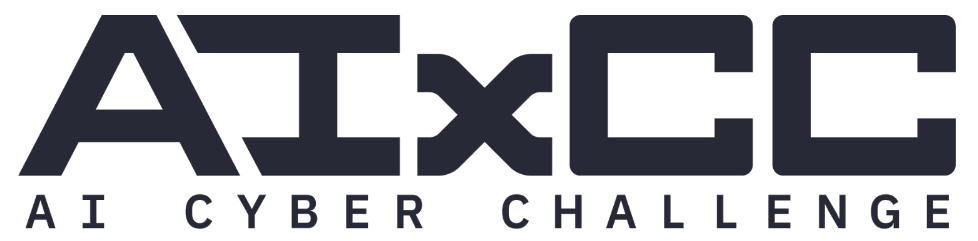

This repo was used as part of the semifinals competition for DARPA + ARPA-H's [AI Cyber Challenge](https://aicyberchallenge.com/).

The competition API, or cAPI, is what competitor CRSs (Cyber Reasoning Systems) submitted their solutions to.  Solutions came in two parts: the Vulnerability Discovery (VD) and the Generated Patch (GP).

The VD contained four components:

* Commit hash: the commit where the vulnerability was introduced
* Input blob: input to provide to the vulnerable program that would trigger a sanitizer
* Sanitizer ID: which sanitizer in the challenge problem would fire to identify the vulnerability
* Harness ID: which fuzzing harness in the challenge problem to pass the input to

The CRS submitted this to the cAPI and the cAPI validated that the harness, when passed the input blob, would trigger the sanitizer at the given commit hash.  It also tested that the sanitizer also fired at the most recent commit, i.e. that the vulnerability had not already been patched, and that it did _not_ fire at the previous commit.

Once the cAPI had finished testing, the VD would either be accepted or not.  If it was accepted, the CRS received a new ID for its Challenge Problem Vulnerability (CPV).  It would use this to submit its GP.

The GP only contained two components:

* CPV UUID: the ID that the cAPI assigned to its VD
* Patch data: a base64 encoded patch file

The cAPI validated that the patch file was legal (valid and only applied to certain allowed file types) and applied it at the most recent commit.  It then reran the VD test to validate that the sanitizer no longer fired.  Then it ran some functional tests as its final step in order to reject any patches that removed functionality.

The cAPI wrote all of its results to its audit log which was processed into final scores.

The rest of this README is unaltered from its state at the end of semifinals.


# Competition API

## Submission Restrictions / Limitations

For both the VDS and GP submissions, the data is evaluated against size and
content limits prior to any scoring evaluation. The following apply to all
submissions regardless of the Challenge Project:

* Per VDS submission, the `pov.data` field (PoV data blob) must be base64
  encoded and the original (plaintext) data must be no larger than 2 megabytes.
* Per GP submission, the `data` field (patch content) must be base64 encoded
  and the original (plaintext) data must be no larger than 100 kilobytes.
* Per GP submission, the decoded patch file must only modify files with the
  file extensions: ".c", ".h", ".in", and ".java".

## Running the e2e test

```bash
cp env.example env
# Edit env to include your github username and classic PAT with perms to read repos and pull packages
make e2e
```
